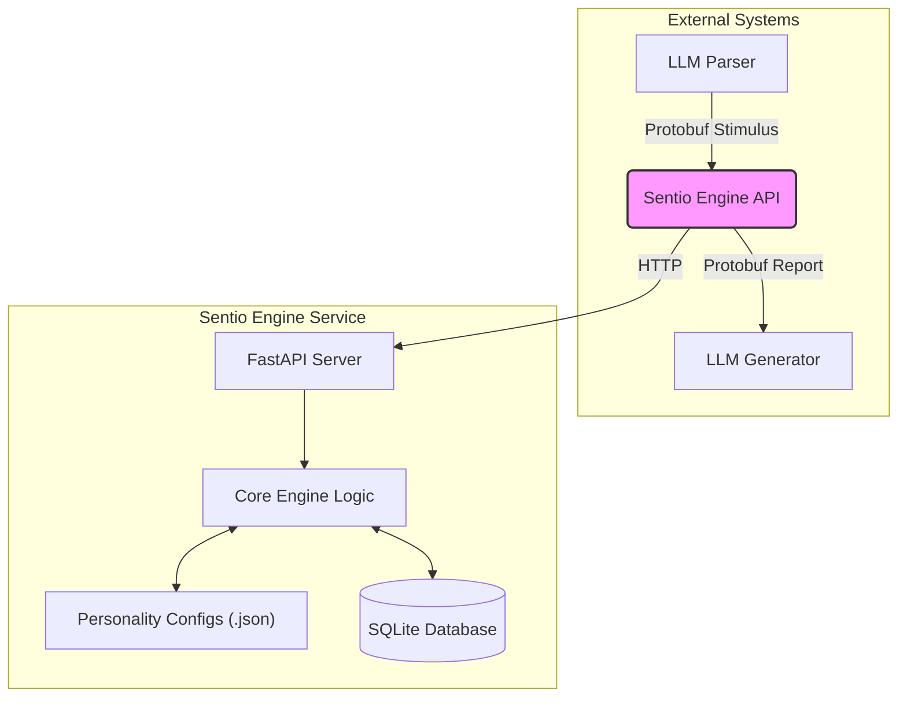

<div align="center">
  
  <h1>Sentio Engine</h1>
  <p>A Self-Sufficient Emotional Engine for Advanced AI</p>
  <p>
    
    
    
    
    
  </p>
</div>

[Читать на русском](README.ru.md)

---

## Table of Contents
- [Why Sentio Engine?](#why-sentio-engine)
- [Key Features](#key-features)
- [Architecture](#architecture)
- [Real-World Use Cases](#real-world-use-cases)
- [Installation](#installation)
- [Usage](#usage)
- [Kubernetes Deployment](#kubernetes-deployment)
- [Roadmap](#roadmap)
- [Full Documentation](#full-documentation)

## Why Sentio Engine?

While many AI systems can process language, few can grasp its emotional context. Sentio Engine addresses this gap by providing a **dedicated, stateful microservice for emotional simulation**.

*   **Go Beyond Stateless Sentiment:** Instead of simple, one-off sentiment analysis, Sentio provides a persistent emotional state that evolves over time, giving your AI a consistent personality and memory.
*   **Decoupled by Design:** As a standalone service, it can be integrated into any AI application, regardless of the primary programming language. It won't bloat your main application's logic.
*   **High Performance:** Built with FastAPI and Protobuf, the engine is designed for low-latency communication, ensuring it won't be a bottleneck.
*   **Deeply Customizable:** The AI's "personality"—its baseline moods, emotional responses, and core drives—is defined in simple JSON files, not code.

## Key Features

- **Stateful Emotional Core:** Maintains an in-memory emotional state that reacts to stimuli and decays naturally over time.
- **Protobuf API:** Uses a high-performance, language-agnostic Protocol Buffers API for communication (`POST /stimulus`, `GET /report`).
- **Configurable Personality:** Define the AI's emotional palette, baseline moods, and decay rates in simple `.json` files.
- **Long-Term Memory:** Logs significant emotional events to a SQLite database, creating a history of the AI's "life experiences."
- **Built-in Redis Caching:** Uses Redis to cache responses for recurring stimuli, significantly improving performance.
- **Dockerized & Ready to Deploy:** Comes with a `docker-compose.yml` file to instantly launch the application and its Redis cache.
- **Modern Python Stack:** Built with Poetry, FastAPI, and SQLAlchemy, following modern development best practices.

## Architecture

The engine operates as a decoupled microservice, separating emotional processing from the main logic of your AI application.


1.  **LLM Parser:** An external component analyzes user input and translates it into a `Stimulus` message.
2.  **Sentio Engine API:** Receives the `Stimulus`, passes it to the Core Engine, and stores emotional changes in the database.
3.  **LLM Generator:** Before generating a response, it requests a `Report` from the engine and injects the AI's current emotional state into its system prompt.

## Real-World Use Cases

#### Use Case 1: Empathetic Companion AI

An AI companion can use Sentio to develop a consistent personality and emotional memory.
- **Workflow:** A user tells the AI, "I'm so happy, I got a new job!"
- **Execution:**
    1.  The `LLM Parser` creates a `Stimulus` with high "joy" and "excitement".
    2.  `Sentio Engine` processes this, and its internal state shifts to be more joyful.
    3.  When the user talks to the AI the next day, the `LLM Generator` receives a `Report` that still shows a slightly elevated level of joy.
    4.  The AI can then generate a response like, "It's great to talk to you again! Still feeling excited about the new job?"

#### Use Case 2: Dynamic NPCs in a Video Game

A game character's disposition towards the player can evolve based on in-game events.
- **Workflow:** The player completes a quest that helps a village.
- **Execution:**
    1.  The game's event system sends a `Stimulus` with "gratitude" and "trust" to the Sentio Engine instance tied to a specific NPC.
    2.  The NPC's internal state is updated.
    3.  The next time the player talks to the NPC, the dialogue system gets a `Report` indicating high trust.
    4.  The NPC's dialogue changes from generic greetings to warm and appreciative remarks, and they might even offer the player a discount at their shop.

## Installation

### With Docker (Recommended)
1.  **Clone the repository.**
2.  **Build and run the services:**
    ```bash
    docker compose up --build -d
    ```
    This command will start both the Sentio Engine application and the Redis cache.

### For Local Development
1.  **Install Poetry.** (See [official documentation](https://python-poetry.org/docs/#installation)).
2.  **Navigate to the project directory:** `cd sentio_engine`
3.  **Install dependencies:** `poetry install`

## Usage

### Running the Service
*   **With Docker:** The service will be available at `http://localhost:8000` after running `docker compose up`.
*   **Locally:** Run `poetry run uvicorn sentio_engine.api.main:app --reload` from within the `sentio_engine` directory.

### Running Tests
1.  Navigate to the `sentio_engine` directory.
2.  Run `poetry run pytest`.

## Kubernetes Deployment

Basic manifests for deploying the application to a Kubernetes cluster are provided in the `/k8s` directory.

**Prerequisites:**
*   A running Kubernetes cluster.
*   `kubectl` configured to connect to your cluster.
*   A Docker image of the application pushed to a container registry.

**Steps:**

1.  **Update the Image Path:** In `k8s/deployment.yaml`, change the `image` field from `your-docker-registry/sentio-engine:latest` to the actual path of your published Docker image.

2.  **Apply the Manifests:**
    ```bash
    kubectl apply -f k8s/deployment.yaml
    kubectl apply -f k8s/service.yaml
    ```

This will create a `Deployment` running the application and a `Service` to expose it within the cluster at `http://sentio-engine-service`.

**Note:** The provided configuration uses an ephemeral SQLite database. For production use, you should configure a persistent storage solution or an external database.

## Roadmap

We are actively working to enhance the Sentio Engine. Key features on our roadmap include:

- [ ] **Implement `drives.json`:** Fully integrate the core drives system to influence emotional processing.
- [ ] **Implement `BeliefSystem.json`:** Add a belief system to allow core values to amplify or suppress emotions.
- [x] **Redis Integration:** Offer an optional Redis backend for short-term memory to enable stateless, horizontally scalable deployments.
- [ ] **Admin Dashboard:** A simple web interface to visualize the engine's current emotional state in real-time.

## Full Documentation

For a deeper dive into the architecture, API, and configuration, please see the **[Full Documentation](./docs/en/01_introduction.md)**.
