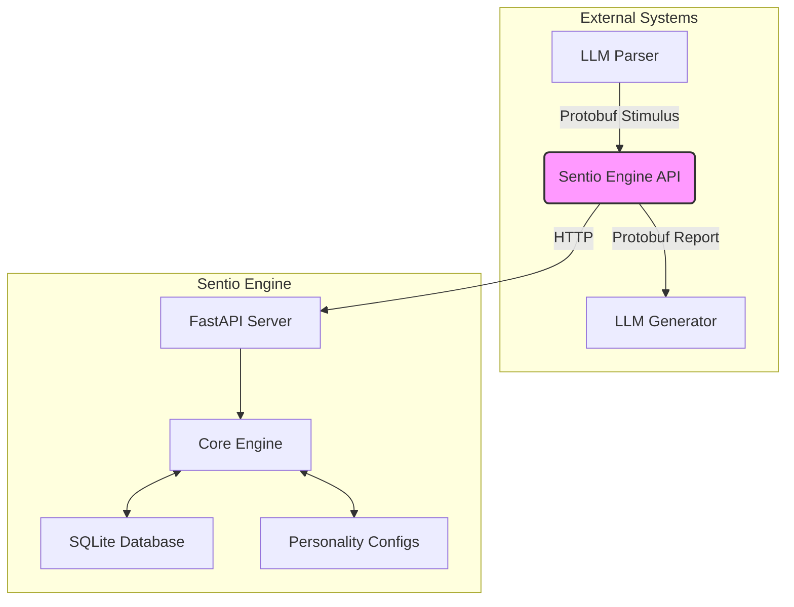

# Sentio Engine

**Sentio Engine** is a sophisticated emotional engine designed to provide deep, nuanced emotional states for AI systems, particularly Large Language Models (LLMs) and NLP modules. It operates as a self-sufficient microservice, allowing for easy integration into any AI project.

This engine simulates a complex emotional life, enabling AI to generate responses that are not only contextually appropriate but also emotionally aware.

[Read the full documentation](./docs/en/01_introduction.md)

---

## Quick Start (Docker)

The fastest way to get the Sentio Engine up and running is with Docker Compose.

1.  **Ensure you have Docker and Docker Compose installed.**
2.  **Clone the repository:**
    ```bash
    git clone <repository_url>
    cd <repository_name>
    ```
3.  **Build and run the service:**
    ```bash
    docker compose up --build -d
    ```
The API will be available at `http://localhost:8000`.

## Development Environment (Poetry)

For local development and contribution, we use Poetry for dependency management.

1.  **Install Poetry.** (See [official documentation](https://python-poetry.org/docs/#installation)).
2.  **Navigate to the project directory:**
    ```bash
    cd sentio_engine
    ```
3.  **Install dependencies:**
    ```bash
    poetry install
    ```
4.  **Run the server:**
    ```bash
    poetry run uvicorn sentio_engine.api.main:app --host 0.0.0.0 --port 8000 --reload
    ```

## Running Tests

To ensure the integrity and correctness of the engine's logic, run the unit tests:

1.  **Navigate to the project directory:**
    ```bash
    cd sentio_engine
    ```
2.  **Execute the tests:**
    ```bash
    poetry run pytest
    ```

## High-Level Architecture

The Sentio Engine is built on a modular, microservice architecture.



For a detailed explanation of the architecture, please see the [full documentation](./docs/en/02_architecture.md).
