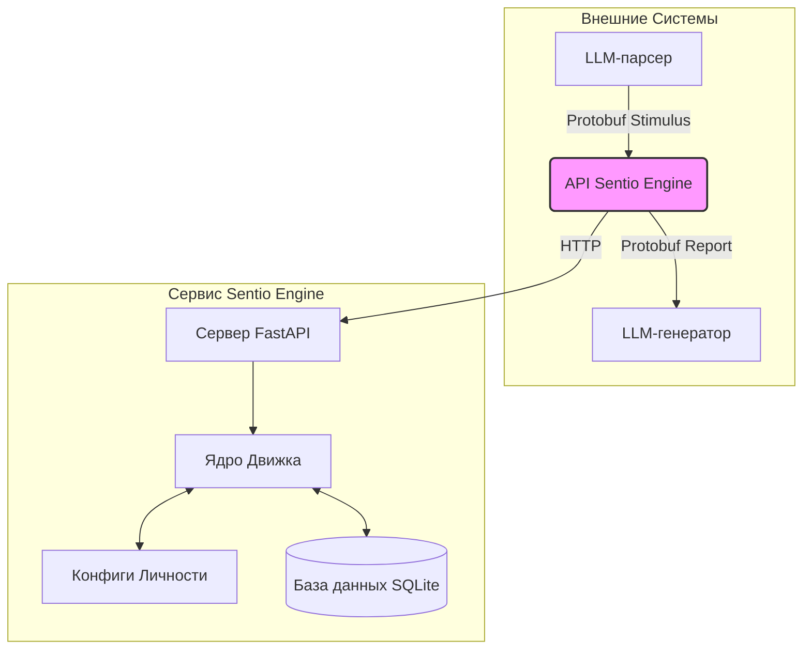

# Sentio Engine (Эмоциональный Движок)

**Sentio Engine** — это продвинутый эмоциональный движок, предназначенный для обеспечения глубоких и детализированных эмоциональных состояний для систем искусственного интеллекта, в частности, для больших языковых моделей (LLM) и NLP-модулей. Он работает как самодостаточный микросервис, что позволяет легко интегрировать его в любой AI-проект.

Этот движок симулирует сложную эмоциональную жизнь, позволяя ИИ генерировать ответы, которые не только контекстуально уместны, но и эмоционально осознанны.

[Читать полную документацию](./docs/ru/01_introduction.md)

---

## Быстрый старт (Docker)

Самый быстрый способ запустить Sentio Engine — это использовать Docker Compose.

1.  **Убедитесь, что у вас установлены Docker и Docker Compose.**
2.  **Склонируйте репозиторий:**
    ```bash
    git clone <repository_url>
    cd <repository_name>
    ```
3.  **Соберите и запустите сервис:**
    ```bash
    docker compose up --build -d
    ```
API будет доступен по адресу `http://localhost:8000`.

## Окружение для разработки (Poetry)

Для локальной разработки и внесения вклада мы используем Poetry для управления зависимостями.

1.  **Установите Poetry.** (См. [официальную документацию](https://python-poetry.org/docs/#installation)).
2.  **Перейдите в директорию проекта:**
    ```bash
    cd sentio_engine
    ```
3.  **Установите зависимости:**
    ```bash
    poetry install
    ```
4.  **Запустите сервер:**
    ```bash
    poetry run uvicorn sentio_engine.api.main:app --host 0.0.0.0 --port 8000 --reload
    ```

## Запуск тестов

Чтобы убедиться в целостности и корректности логики движка, запустите модульные тесты:

1.  **Перейдите в директорию проекта:**
    ```bash
    cd sentio_engine
    ```
2.  **Выполните тесты:**
    ```bash
    poetry run pytest
    ```

## Высокоуровневая архитектура

Sentio Engine построен на модульной, микросервисной архитектуре.



Для подробного объяснения архитектуры, пожалуйста, обратитесь к [полной документации](./docs/ru/02_architecture.md).
