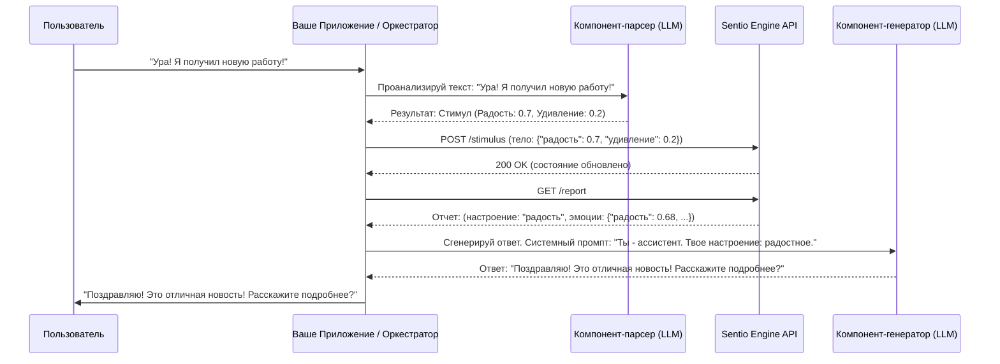

# Как Sentio Engine взаимодействует с Внешними LLM-системами

Этот документ объясняет архитектуру и логику взаимодействия `Sentio Engine` с внешними системами, такими как большие языковые модели (LLM).

## Основной Принцип: Разделение Ответственности (Decoupling)

Самое важное, что нужно понять: **`Sentio Engine` — это не языковая модель (LLM)**. Это отдельный, специализированный микросервис, единственная задача которого — симулировать и отслеживать эмоциональное состояние.

Такой подход (Decoupling) имеет ключевые преимущества:
1.  **Независимость:** `Sentio Engine` может работать с *любой* LLM (от OpenAI, Anthropic, Google или локальной).
2.  **Чистота кода:** Логика эмоционального состояния не "загрязняет" основной код вашего AI-приложения.
3.  **Производительность:** `Sentio` — это легковесный сервис, оптимизированный для быстрых вычислений состояния, в то время как LLM — тяжеловесная система для генерации текста.

Проще говоря, **`Sentio Engine` — это "сердце", а LLM — это "мозг"**. Мозг обращается к сердцу, чтобы понять, что "чувствовать" перед тем, как что-то сказать.

## Архитектура и Поток Данных

Вот как выглядит полный цикл взаимодействия на практике:



### Пошаговое объяснение:

1.  **Пользователь отправляет сообщение.**
    *   Пример: `"Какой ужасный день, я провалил экзамен."`

2.  **Компонент-парсер (LLM Parser) анализирует текст.**
    *   Это **внешняя** по отношению к `Sentio` система. Чаще всего это может быть еще один вызов LLM с задачей в системном промпте: `"Твоя задача — извлечь эмоции из текста и оценить их по шкале от 0 до 1. Верни результат в формате JSON."`
    *   **Результат анализа:** `Stimulus` (Стимул). Для нашего примера, парсер вернет что-то вроде: `{"грусть": 0.8, "злость": 0.4}`.

3.  **Ваше приложение отправляет `Stimulus` в `Sentio Engine`.**
    *   Происходит `POST` запрос на эндпоинт `/stimulus` вашего `Sentio Engine`.
    *   `Sentio Engine` получает этот "эмоциональный укол", обновляет свое внутреннее состояние (увеличивает интенсивность грусти и злости) и сохраняет это изменение в своей базе данных (это его долговременная память).

4.  **Ваше приложение запрашивает эмоциональный отчет.**
    *   Перед тем как генерировать ответ пользователю, ваше приложение делает `GET` запрос на эндпоинт `/report`.
    *   `Sentio Engine` возвращает `Report` (Отчет), содержащий полное текущее эмоциональное состояние. Например: `{"primary_mood": "преобладает грусть", "emotions": {"грусть": 0.78, "злость": 0.35, "радость": 0.1, ...}}`.

5.  **Приложение использует отчет для генерации ответа.**
    *   Этот отчет встраивается в системный промпт основной LLM (Компонента-генератора).
    *   **Пример системного промпта:** `"Ты — поддерживающий и эмпатичный друг. Твое текущее эмоциональное состояние: преобладает грусть. Основываясь на этом, ответь пользователю на его сообщение: 'Какой ужасный день, я провалил экзамен.'"`

6.  **LLM-генератор создает "эмоционально окрашенный" ответ.**
    *   Благодаря контексту из `Sentio`, LLM сгенерирует не стандартный ответ ("Я понимаю"), а что-то более человечное и подходящее моменту: `"О, мне так жаль это слышать. Провалить экзамен — это очень тяжело. Не кори себя за это, такое случается. Хочешь поговорить об этом?"`

## Заключение

`Sentio Engine` предоставляет механизм **сохранения состояния** (state management) для эмоций. Он позволяет вашему AI не просто реагировать на последнее сообщение, а иметь последовательную, развивающуюся со временем "личность", которая помнит прошлые взаимодействия и обладает настроением.

## Продвинутый Паттерн: Встроенный Эмоциональный Отчет (Agent Protocol)

Чтобы сделать взаимодействие между LLM-агентом и `Sentio Engine` еще более надежным, был добавлен новый эндпоинт `POST /process_agent_text`.

Он решает важную проблему: как агенту сообщить о своем эмоциональном состоянии, чтобы `Sentio` не парсил случайные слова из ответа пользователя.

### Как это работает:

1.  **Агент формирует ответ с тегом.** После генерации ответа для пользователя, агент добавляет в конец своего полного ответа специальный блок-тег `[SENTIO_EMO_STATE]`, внутри которого находится JSON с его "сухим" эмоциональным состоянием.
2.  **Приложение отправляет полный текст в `Sentio`**. Весь текст, включая тег, отправляется на эндпоинт `/process_agent_text`.
3.  **`Sentio` парсит только тег**. Движок ищет только блок `[SENTIO_EMO_STATE]...[/SENTIO_EMO_STATE]` и игнорирует весь остальной текст. Это гарантирует, что `Sentio` отреагирует только на явно выраженное состояние агента.

### Пример

Агент хочет сказать пользователю "Все будет хорошо" и сообщить `Sentio` о своем состоянии.

**Полный текст, отправляемый на `POST /process_agent_text`:**
```json
{
  "text": "Все будет хорошо. Я здесь, чтобы помочь.\n\n[SENTIO_EMO_STATE]\n{\n  \"доверие\": 0.7,\n  \"радость\": 0.4\n}\n[/SENTIO_EMO_STATE]"
}
```

`Sentio Engine` проигнорирует фразу "Все будет хорошо" и обработает только `{"доверие": 0.7, "радость": 0.4}`. Этот паттерн превращает `Sentio Engine` в надежный "инструмент" для агентов, работающих по `ReAct` и схожим паттернам.
