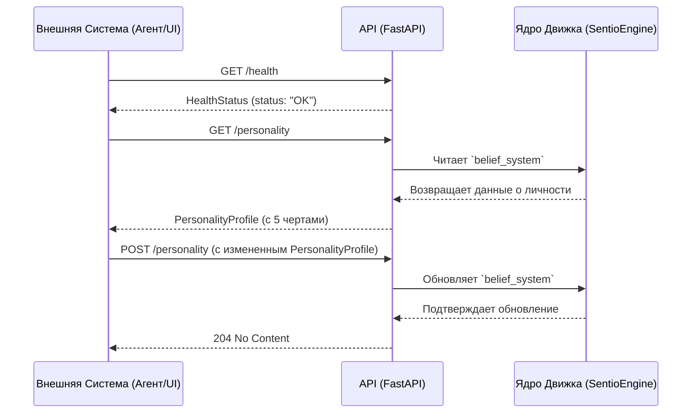

```mermaid
sequenceDiagram
    participant C as Внешняя Система (Агент/UI)
    participant A as API (FastAPI)
    participant E as Ядро Движка (SentioEngine)

    C->>A: GET /health
    A-->>C: HealthStatus (status: "OK")

    C->>A: GET /personality
    A->>E: Читает `belief_system`
    E-->>A: Возвращает данные о личности
    A-->>C: PersonalityProfile (с 5 чертами)

    C->>A: POST /personality (с измененным PersonalityProfile)
    A->>E: Обновляет `belief_system`
    E-->>A: Подтверждает обновление
    A-->>C: 204 No Content
```
