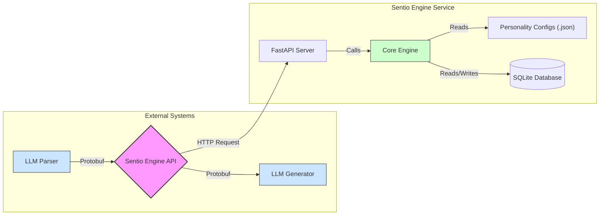

# Architecture Deep Dive

The Sentio Engine is designed as a modular and decoupled microservice. This architecture ensures that the emotional processing core is isolated and can be integrated into various external systems without tight coupling.

Below is a detailed breakdown of each component and its role within the ecosystem.

## Component Diagram

## Component Breakdown

### 1. External Systems

These are not part of the Sentio Engine service but are its primary consumers.

*   **LLM Parser:** This is a conceptual component (e.g., a function in your chatbot's backend) responsible for analyzing user input (text, voice, etc.) and translating it into an emotional **Stimulus**.
    *   *Example:* User says, "Wow, thank you so much!" The parser analyzes this and generates a Protobuf message: `Stimulus(emotions={"gratitude": 0.8, "joy": 0.6})`.
*   **LLM Generator:** This is the main LLM of your application. It receives the emotional **Report** from the Sentio Engine and uses it to style its response. The report can be injected into the system prompt to guide the tone and content of the generated text.

### 2. Sentio Engine API

The single point of entry into the service.

*   **Technology:** **FastAPI**.
*   **Protocol:** **Protocol Buffers (Protobuf)** over HTTP. This ensures high performance and strongly typed contracts between the service and its clients.
*   **Endpoints:**
    *   `POST /stimulus`: Accepts a `Stimulus` message to update the engine's state.
    *   `GET /report`: Returns a `Report` message detailing the current emotional state.

### 3. Core Engine (`SentioEngine` class)

This is the heart of the service, where all emotional processing takes place.

*   **Responsibilities:**
    *   **State Management:** Holds the current `EmotionalState` in memory (short-term memory).
    *   **Configuration Loading:** On startup, it loads the "personality" from the JSON configuration files.
    *   **Stimulus Processing:** Applies mathematical models to update the emotional state based on incoming stimuli.
    *   **Emotion Decay:** Simulates the natural fading of emotions over time, causing them to return to a baseline.
    *   **Database Interaction:** Logs significant emotional changes to the long-term memory (SQLite database).

### 4. Personality Configs (`.json` files)

These files define the unique "DNA" of the AI's personality. They are loaded once on startup.

*   **`emotions.json`:** Defines all possible emotions, their base intensity, and their decay rate.
*   **`drives.json`:** (Future extension) Can be used to define core motivations like "curiosity" or "social connection" that influence emotional reactions.
*   **`BeliefSystem.json`:** (Future extension) Can define core values that might amplify or suppress certain emotions.

### 5. SQLite Database (Long-Term Memory)

The database provides persistence and a sense of history.

*   **Technology:** **SQLAlchemy** with a **SQLite** backend.
*   **Tables:**
    *   `EmotionalHistory`: A log of all significant emotional changes, providing a timeline of the AI's "feelings."
    *   `EmotionalMemory`: (Future extension) Can store powerful "triggers"—associations between specific stimuli and strong emotional responses (e.g., trauma or cherished memories).
    *   `RelationshipState`: (Future extension) Can track relationship metrics (e.g., trust, intimacy) with different users.

This architecture ensures a clean separation of concerns, making the system scalable, testable, and easy to maintain.

---

**Next:** [API Reference](./03_api_reference.md)
