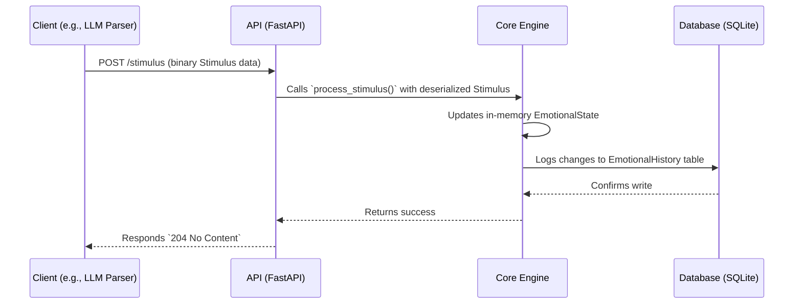

# API Reference

The Sentio Engine API is designed for simplicity and performance, using Protocol Buffers (Protobuf) for data exchange.

## Endpoints

### 1. `POST /stimulus`

This is the primary endpoint for influencing the engine's emotional state.

*   **Method:** `POST`
*   **Request Body:** A binary, serialized `Stimulus` Protobuf message.
*   **Content-Type:** `application/protobuf`
*   **Successful Response:** `204 No Content`. This indicates that the stimulus was received and processed successfully.
*   **Error Response:** `400 Bad Request` if the request body is not a valid `Stimulus` message.

#### Sequence Diagram

This diagram shows the flow of a typical `POST /stimulus` request.



### 2. `GET /report`

This endpoint retrieves the current emotional state of the engine.

*   **Method:** `GET`
*   **Response Body:** A binary, serialized `Report` Protobuf message.
*   **Content-Type:** `application/protobuf`
*   **Successful Response:** `200 OK` with the binary `Report` in the body.

## Protobuf Schemas

The API uses the following Protobuf messages, defined in `sentio_engine/schemas/sentio.proto`.

### `Stimulus`

Represents an external event that can trigger an emotional change.

```proto
message Stimulus {
  // A map of emotion names to their intensity (0.0 to 1.0).
  // The engine will add this intensity to the current state.
  map<string, float> emotions = 1;
}
```

### `Report`

The complete snapshot of the engine's current state, sent to clients.

```proto
message Report {
  EmotionalState emotional_state = 1;
  // Future extensions like neuromediator levels can be added here.
}
```

### `EmotionalState`

Describes the internal emotional state of the AI. This is the core data structure within the `Report`.

```proto
message EmotionalState {
  // The current intensity of all active emotions.
  map<string, float> emotions = 1;

  // The dominant mood derived from the current emotions.
  string primary_mood = 2;

  // The most recent cause for the current emotional state.
  string cause = 3;
}
```

## Example Client (Python)

Here is a simple example of how to interact with the API using Python.

```python
import requests
from sentio_engine.schemas.sentio_pb2 import Stimulus, Report

BASE_URL = "http://127.0.0.1:8000"

# --- Create and send a stimulus ---
stimulus = Stimulus()
stimulus.emotions["joy"] = 0.7
stimulus.emotions["curiosity"] = 0.4

response = requests.post(
    f"{BASE_URL}/stimulus",
    data=stimulus.SerializeToString(),
    headers={'Content-Type': 'application/protobuf'}
)
print(f"Stimulus sent. Status code: {response.status_code}")


# --- Get the updated report ---
response = requests.get(f"{BASE_URL}/report")
if response.status_code == 200:
    report = Report()
    report.ParseFromString(response.content)
    print("Received report:")
    print(report)
```

---

**Next:** [Personality Configuration](./04_configuration.md)
