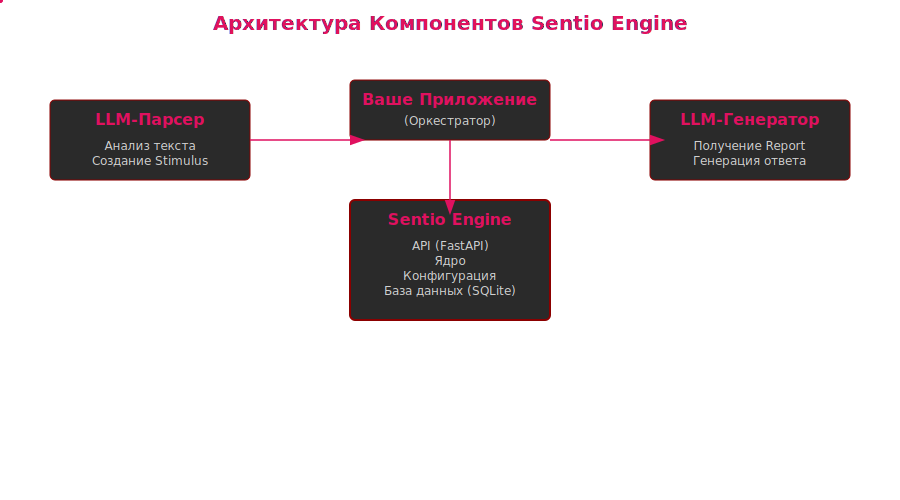
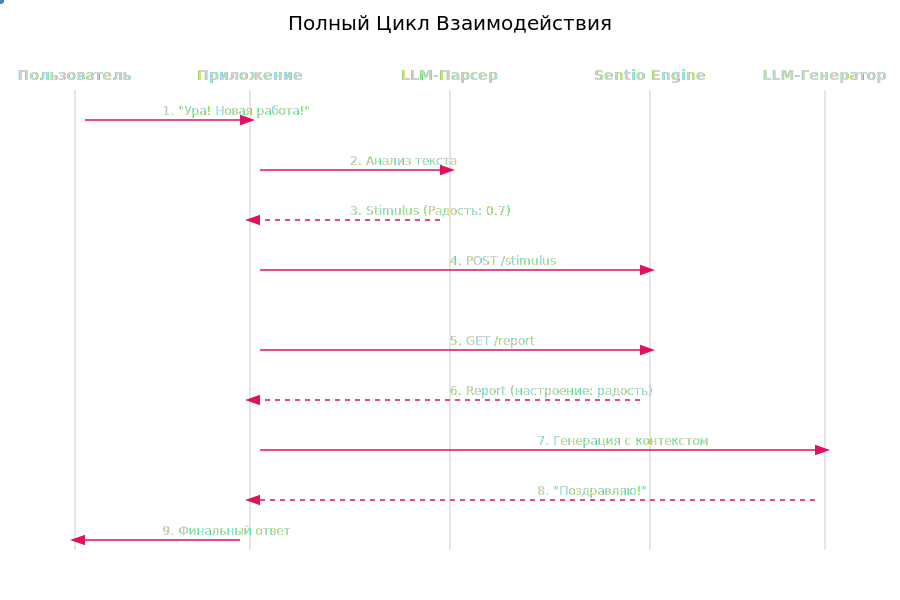

# Архитектура

## Ключевой Принцип: Разделение Ответственности

Самое важное, что нужно понять: **`Sentio Engine` — это не языковая модель (LLM)**. Это отдельный, специализированный микросервис, единственная задача которого — симулировать и отслеживать эмоциональное состояние.

Такой подход (Decoupling) имеет ключевые преимущества:
1.  **Независимость:** `Sentio Engine` может работать с *любой* LLM (от OpenAI, Anthropic, Google или локальной).
2.  **Чистота кода:** Логика эмоционального состояния не "загрязняет" основной код вашего AI-приложения.
3.  **Производительность:** `Sentio` — это легковесный сервис, оптимизированный для быстрых вычислений состояния, в то время как LLM — тяжеловесная система для генерации текста.

Проще говоря, **`Sentio Engine` — это "сердце", а LLM — это "мозг"**. Мозг обращается к сердцу, чтобы понять, что "чувствовать" перед тем, как что-то сказать.

## Компоненты Системы

  

## Описание компонентов

### 1. Внешние системы

Эти компоненты не являются частью сервиса Sentio Engine, но являются его основными потребителями.

*   **LLM-парсер:** Это концептуальный компонент (например, функция в бэкенде вашего чат-бота), отвечающий за анализ пользовательского ввода (текст, голос и т.д.) и его преобразование в эмоциональный **Стимул**.
    *   *Пример:* Пользователь говорит: «Вау, спасибо вам огромное!» Парсер анализирует это и генерирует Protobuf-сообщение: `Stimulus(emotions={"благодарность": 0.8, "радость": 0.6})`.
*   **LLM-генератор:** Это основная LLM вашего приложения. Она получает эмоциональный **Отчет** от Sentio Engine и использует его для стилизации своего ответа. Отчет можно внедрить в системный промпт, чтобы направить тон и содержание генерируемого текста.

### 2. API Sentio Engine

Единая точка входа в сервис.

*   **Технология:** **FastAPI**.
*   **Протокол:** **Protocol Buffers (Protobuf)** через HTTP. Это обеспечивает высокую производительность и строго типизированные контракты между сервисом и его клиентами.
*   **Эндпоинты:**
    *   `POST /stimulus`: Принимает сообщение `Stimulus` для обновления состояния движка.
    *   `GET /report`: Возвращает сообщение `Report`, детализирующее текущее эмоциональное состояние.

### 3. Ядро Движка (класс `SentioEngine`)

Это сердце сервиса, где происходит вся эмоциональная обработка.

*   **Обязанности:**
    *   **Управление состоянием:** Хранит текущее `EmotionalState` в памяти (краткосрочная память).
    *   **Загрузка конфигурации:** При запуске загружает «личность» из JSON-файлов конфигурации.
    *   **Обработка стимулов:** Применяет математические модели для обновления эмоционального состояния на основе входящих стимулов.
    *   **Затухание эмоций:** Симулирует естественное угасание эмоций со временем, заставляя их возвращаться к базовому уровню.
    *   **Взаимодействие с БД:** Записывает значительные эмоциональные изменения в долгосрочную память (базу данных SQLite).

### 4. Конфиги Личности (файлы `.json`)

Эти файлы определяют уникальную «ДНК» личности ИИ. Они загружаются один раз при запуске.

*   **`emotions.json`:** Определяет все возможные эмоции, их базовую интенсивность и скорость затухания.
*   **`drives.json`:** (Будущее расширение) Может использоваться для определения основных мотиваций, таких как «любопытство» или «социальная связь», которые влияют на эмоциональные реакции.
*   **`BeliefSystem.json`:** (Будущее расширение) Может определять основные ценности, которые могут усиливать или подавлять определенные эмоции.

### 5. База данных SQLite (Долгосрочная память)

База данных обеспечивает персистентность и ощущение истории.

*   **Технология:** **SQLAlchemy** с бэкендом **SQLite**.
*   **Таблицы:**
    *   `EmotionalHistory`: Журнал всех значительных эмоциональных изменений, предоставляющий временную шкалу «чувств» ИИ.
    *   `EmotionalMemory`: (Будущее расширение) Может хранить мощные «триггеры» — ассоциации между конкретными стимулами и сильными эмоциональными реакциями (например, травмы или дорогие воспоминания).
    *   `RelationshipState`: (Будущее расширение) Может отслеживать метрики отношений (например, доверие, близость) с разными пользователями.

Эта архитектура обеспечивает чистое разделение ответственности, делая систему масштабируемой, тестируемой и легкой в обслуживании.

## Поток Данных: Полный Цикл Взаимодействия

Вот как выглядит полный цикл взаимодействия на практике:

  

### Пошаговое объяснение:

1.  **Пользователь отправляет сообщение.**
    *   Пример: `"Какой ужасный день, я провалил экзамен."`

2.  **Компонент-парсер (LLM Parser) анализирует текст.**
    *   Это **внешняя** по отношению к `Sentio` система. Чаще всего это может быть еще один вызов LLM с задачей в системном промпте: `"Твоя задача — извлечь эмоции из текста и оценить их по шкале от 0 до 1. Верни результат в формате JSON."`
    *   **Результат анализа:** `Stimulus` (Стимул). Для нашего примера, парсер вернет что-то вроде: `{"грусть": 0.8, "злость": 0.4}`.

3.  **Ваше приложение отправляет `Stimulus` в `Sentio Engine`.**
    *   Происходит `POST` запрос на эндпоинт `/stimulus` вашего `Sentio Engine`.
    *   `Sentio Engine` получает этот "эмоциональный укол", обновляет свое внутреннее состояние и сохраняет это изменение в своей базе данных.

4.  **Ваше приложение запрашивает эмоциональный отчет.**
    *   Перед тем как генерировать ответ пользователю, ваше приложение делает `GET` запрос на эндпоинт `/report`.
    *   `Sentio Engine` возвращает `Report` (Отчет), содержащий полное текущее состояние.

5.  **Приложение использует отчет для генерации ответа.**
    *   Этот отчет встраивается в системный промпт основной LLM (Компонента-генератора).
    *   **Пример системного промпта:** `"Ты — поддерживающий и эмпатичный друг. Твое текущее эмоциональное состояние: преобладает грусть. Основываясь на этом, ответь пользователю на его сообщение: 'Какой ужасный день, я провалил экзамен.'"`

6.  **LLM-генератор создает "эмоционально окрашенный" ответ.**
    *   Благодаря контексту из `Sentio`, LLM сгенерирует не стандартный ответ ("Я понимаю"), а что-то более человечное и подходящее моменту.

---

**Далее:** [Справочник по API](./03_api_reference.md)
