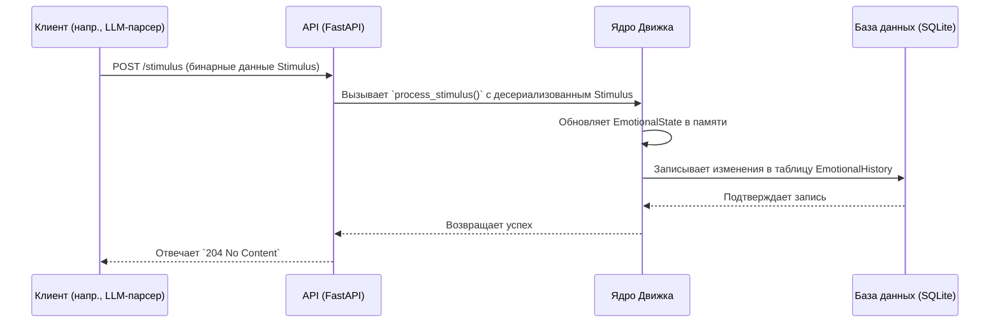

# Справочник по API

API Sentio Engine спроектирован для простоты и производительности, используя Protocol Buffers (Protobuf) для обмена данными.

## Эндпоинты

### 1. `POST /stimulus`

Это основной эндпоинт для влияния на эмоциональное состояние движка.

*   **Метод:** `POST`
*   **Тело запроса:** Бинарное, сериализованное `Stimulus` Protobuf-сообщение.
*   **Content-Type:** `application/protobuf`
*   **Успешный ответ:** `204 No Content`. Это означает, что стимул был успешно получен и обработан.
*   **Ответ с ошибкой:** `400 Bad Request`, если тело запроса не является валидным `Stimulus` сообщением.

#### Диаграмма последовательности

Эта диаграмма показывает поток типичного запроса `POST /stimulus`.



### 2. `GET /report`

Этот эндпоинт получает текущее эмоциональное состояние движка.

*   **Метод:** `GET`
*   **Тело ответа:** Бинарное, сериализованное `Report` Protobuf-сообщение.
*   **Content-Type:** `application/protobuf`
*   **Успешный ответ:** `200 OK` с бинарным `Report` в теле.

## Схемы Protobuf

API использует следующие Protobuf-сообщения, определенные в `sentio_engine/schemas/sentio.proto`.

### `Stimulus`

Представляет внешнее событие, которое может вызвать эмоциональное изменение.

```proto
message Stimulus {
  // Карта названий эмоций и их интенсивности (от 0.0 до 1.0).
  // Движок добавит эту интенсивность к текущему состоянию.
  map<string, float> emotions = 1;
}
```

### `Report`

Полный снимок текущего состояния движка, отправляемый клиентам.

```proto
message Report {
  EmotionalState emotional_state = 1;
  // Будущие расширения, такие как уровни нейромедиаторов, могут быть добавлены здесь.
}
```

### `EmotionalState`

Описывает внутреннее эмоциональное состояние ИИ. Это основная структура данных внутри `Report`.

```proto
message EmotionalState {
  // Текущая интенсивность всех активных эмоций.
  map<string, float> emotions = 1;

  // Доминирующее настроение, производное от текущих эмоций.
  string primary_mood = 2;

  // Самая последняя причина текущего эмоционального состояния.
  string cause = 3;
}
```

## Пример клиента (Python)

Вот простой пример того, как взаимодействовать с API с помощью Python.

```python
import requests
from sentio_engine.schemas.sentio_pb2 import Stimulus, Report

BASE_URL = "http://127.0.0.1:8000"

# --- Создание и отправка стимула ---
stimulus = Stimulus()
stimulus.emotions["радость"] = 0.7
stimulus.emotions["любопытство"] = 0.4

response = requests.post(
    f"{BASE_URL}/stimulus",
    data=stimulus.SerializeToString(),
    headers={'Content-Type': 'application/protobuf'}
)
print(f"Стимул отправлен. Код состояния: {response.status_code}")


# --- Получение обновленного отчета ---
response = requests.get(f"{BASE_URL}/report")
if response.status_code == 200:
    report = Report()
    report.ParseFromString(response.content)
    print("Получен отчет:")
    print(report)
```

---

**Далее:** [Конфигурация личности](./04_configuration.md)
